# RepoPilot AI — Implementation Plan

> Status: **Approved plan, not started.** Read together with [`ARCHITECTURE.md`](./ARCHITECTURE.md) (decisions D1–D15 in §2) and [`DECISIONS_REVIEW.md`](./DECISIONS_REVIEW.md).
> Phase 0 starts only on an explicit go-ahead.

## Guiding principles

- **Vertical slices**: every phase ends with something deployable and demoable end-to-end (UI → API → DB → worker).
- **De-risk early**: the hardest unknowns (ingestion, retrieval quality, citations) come before "nice-to-have" analyzers.
- **MVP = Phases 0–3** (import → search → cited chat). That is the portfolio centrepiece; later phases add to it.
- **Public repos only in v1**: private repos (GitHub App) are an optional Phase 7 that plugs into the same pipeline.
- **Minimal infrastructure**: one Render service (API + in-process worker), MongoDB for data + jobs + search, no Redis, no Turborepo.
- **Credit-efficient testing**: small pinned fixture repos, recorded GitHub responses, mocked LLM/embedding calls in CI; live AI calls only in the on-demand eval run.
- **Small PRs**: each phase is broken into PR-sized steps (≈ 200–600 lines each) with tests.
- **Definition of Done (every PR)**: lint + typecheck + tests green in CI, no secrets committed, API schemas in `@repopilot/shared`, docs updated where behaviour changes.

## Phase overview

| Phase | Name | Outcome | Est. effort* |
|---|---|---|---|
| 0 | Foundations | Monorepo, local Atlas via Docker, CI, auth end-to-end, deploy skeletons | 1 session |
| 1 | Import & structure | Import public repo, ingestion pipeline, file explorer, structure overview | 1–1.5 sessions |
| 2 | Indexing & search | TS/JS + Python parsing, chunking, embeddings, Atlas Vector + Search indexes, hybrid search UI | 1–1.5 sessions |
| 3 | AI chat + citations | Streaming RAG chat with validated, clickable citations; eval harness | 1–2 sessions |
| 4 | Insights | Dependencies (OSV), security findings, quality metrics, architecture graph | 1.5–2 sessions |
| 5 | AI documentation | Summaries → generated docs, export | 1 session |
| 6 | Hardening & launch | Quotas, rate limits, E2E, performance, security review, demo launch | 1 session |
| 7 | *(optional)* Private repos & freshness | GitHub App, installation linking, push webhooks, incremental re-index | 1–2 sessions |

\*Effort is in Devin working sessions. **MVP (0–3) ≈ 4–6 sessions; full v1 without private repos ≈ 7–10 sessions; Phase 7 adds 1–2.** External waits (accounts, secrets, your reviews) are additional and called out per phase.

```mermaid
gantt
  dateFormat X
  axisFormat %s
  section MVP
  P0 Foundations        :p0, 0, 1
  P1 Import & structure :p1, after p0, 2
  P2 Indexing & search  :p2, after p1, 2
  P3 Chat + citations   :p3, after p2, 2
  section v1
  P4 Insights           :p4, after p3, 2
  P5 AI docs            :p5, after p4, 1
  P6 Hardening & launch :p6, after p5, 1
  section Optional
  P7 Private repos      :p7, after p6, 2
```

Phase 4 depends only on Phase 1–2 output and could run before Phase 3 if desired.

---

## Prerequisites (accounts & secrets you'll need to provide)

Having everything for Phases 0–3 ready before Phase 0 avoids sessions stalling on credentials.

| Needed by | Item |
|---|---|
| Phase 0 | Clerk application (development instance): publishable + secret key, webhook secret |
| Phase 0 | MongoDB Atlas **Free (M0)** cluster in a dedicated project, connection string (DB user scoped to the app DB). Local dev needs only Docker. |
| Phase 0 | Vercel project linked to the repo (Hobby); Render account (web service; Free for dev, Starter $7/mo for the always-on demo) |
| Phase 1 | GitHub fine-grained token, public read-only (service token) |
| Phase 2–3 | OpenRouter API key with a **credit limit** (separate dev and prod keys); used for both embeddings and chat |
| Phase 6 | Clerk production instance; optional Sentry DSN (free plan); optional custom domain |
| Phase 7 *(optional)* | GitHub App (App ID, private key, client ID/secret, webhook secret) |

---

## Phase 0 — Foundations

**Goal**: an empty but production-shaped app: sign in on the deployed frontend and call an authenticated API endpoint backed by MongoDB.

**PRs**
1. **Monorepo scaffold** — pnpm workspaces (`apps/web`, `apps/api`, `packages/shared`), `tsconfig.base.json` (strict), ESLint flat config + Prettier, Husky + lint-staged pre-commit, `.editorconfig`, `.nvmrc` (Node 22), `.env.example` files, root scripts (`dev`, `build`, `lint`, `typecheck`, `test`), `docker-compose.yml` with `mongodb/mongodb-atlas-local`.
2. **CI** — GitHub Actions: install (cached), lint, typecheck, test, build; Dependabot config; pinned action SHAs.
3. **API skeleton** — Express 5 app factory, Zod-validated config, pino logging + request IDs, helmet/CORS/compression, central error handler + `AppError`s, `/healthz` + `/readyz`, Mongoose connection with graceful shutdown, Dockerfile, `server.ts` (starts the worker loop when `RUN_WORKER=true`) + standalone `worker.ts`.
4. **Auth** — `@clerk/express` middleware, `requireAuth`, `users` model + lazy upsert, `GET /api/v1/me`, Clerk webhook (`/webhooks/clerk`, svix verification, raw body), tests with signed fixtures.
5. **Web skeleton** — Vite + React + TS + Tailwind v4 + shadcn/ui, React Router, Clerk provider, TanStack Query, typed API client using shared schemas, app shell (sidebar/topbar, dark mode), sign-in/up pages, dashboard placeholder calling `/me`.
6. **Deploy** — Vercel project (SPA rewrites, env vars), one Render web service from the Docker image (`RUN_WORKER=true`), Atlas M0; README with local setup (`docker compose up`, `pnpm dev`).

**Acceptance criteria**
- A user can sign up/in on the Vercel URL and see their profile fetched from the deployed API.
- Unauthenticated calls to `/api/v1/me` return `401` with the standard error shape.
- `docker compose up && pnpm dev` gives a working local stack with no cloud database.
- CI green; pre-commit hooks run lint-staged.

**External waits**: Clerk, Atlas, Vercel, Render accounts + secrets.

---

## Phase 1 — Repository import & structure analysis

**Goal**: paste a public GitHub URL, watch ingestion progress, browse files, see a structure overview.

**PRs**
1. **Shared contracts** — Zod schemas/enums for repositories, snapshots, files, jobs, errors, pagination.
2. **Job queue** — `jobs` model + indexes, `JobQueue` interface, Mongo implementation (atomic claim, lease, heartbeat, reaper, backoff, `dedupeKey`), in-process worker loop with graceful shutdown and configurable concurrency; unit + integration tests (two runners never claim the same job; expired lease is reclaimed).
3. **GitHub client** — Octokit with throttling/retry, repo URL parser (`owner/repo`, https, `.git`, tree/blob URLs), `GET /github/resolve`, size pre-check from repo metadata (D8: 2,000 files / 20 MB / 512 KB per file), global daily import cap.
4. **Data models** — `repositories`, `repoAccess`, `snapshots`, `files` (metadata only, no contents — D14), `auditLogs` + indexes; access-control data layer (`AuthorizedRepo`, `AuthorizedSnapshot`) and `requireRepoAccess` middleware with IDOR tests.
5. **Ingestion stages 1–5** — resolve SHA, stream tarball, safe extraction (zip-slip, symlinks, caps), filters/ignore rules, classification (language map, LOC, binary, generated, kind), persist file metadata; progress updates; failure handling; fixture-repo tests including a malicious archive.
6. **Repository API** — `POST/GET/PATCH/DELETE /repositories`, `POST /reindex`, snapshots endpoints, `tree`, `file` (content fetched from GitHub at the snapshot commit SHA, LRU-cached); shared-index reuse for an already-indexed (repo, commit) (D7).
7. **Structure analyzer** — language breakdown, directory aggregates, framework/entry-point/monorepo detection → `analyses(type=structure)`.
8. **Web: import & explorer** — Repos list with status badges, Import page (URL validation via `/github/resolve`), progress view (polling), repo view layout with tabs, Files tab (lazy tree + Shiki viewer with line anchors `?path=&lines=`), Overview tab (stats, languages chart, frameworks).

**Acceptance criteria**
- Importing a ~1,000-file public repo completes and is browsable; progress visible throughout.
- Re-importing the same repo/commit by another user reuses the existing snapshot (no second download).
- Oversized repos are rejected with a clear error before download.
- A user cannot access another user's repo by ID (tested).
- No repository code is executed, and no full file contents are persisted.

**External waits**: GitHub service token.

---

## Phase 2 — Indexing & semantic search

**Goal**: high-quality hybrid search across code with filters.

**PRs**
1. **Tree-sitter parsing** — `web-tree-sitter` with **TS/JS and Python** grammars (D12); extract symbols + imports into `files`; regex import detection for other languages; time budgets and graceful fallback.
2. **Chunker** — AST-aware chunking, merge/split rules, line-window fallback, contextual headers, token counting; golden-file tests.
3. **Secret redaction (minimal)** — core secret rules applied to chunk text before persistence/embedding (full scanner comes in Phase 4).
4. **Embedding provider** — `EmbeddingProvider` interface; OpenRouter implementation (`voyageai/voyage-code-4`) with Voyage-direct fallback; spike to confirm `output_dimension` (1024 vs 512) support; batching, concurrency, retries, `data_collection: "deny"`, vector reuse from the previous snapshot by (`embeddingModel`, `contentHash`), usage metering into `usageEvents`.
5. **Chunks + indexes** — `chunks` model with BSON `binData` float32 vectors, bulk insert, search-index script (`chunks_vector`, `chunks_text` with code analyzer) for Atlas and Atlas Local, snapshot `ready` transition + active-snapshot flip + GC job (keep last 2 snapshots).
6. **Search service** — vector search (pre-filtered by `snapshotId`), text search, app-side RRF fusion, path/symbol boosting, filters (`language`, `dir`, `kind`), highlights; `POST /repositories/:id/search`; integration tests against the `mongodb-atlas-local` container.
7. **Web: search** — Search tab with mode toggle, filters, result cards (path, lines, highlighted snippet) that deep-link into the file viewer.

**Acceptance criteria**
- Natural-language queries (e.g. "where are JWTs verified?") surface the right file in the top 5 for the fixture repos.
- Exact identifier queries return the defining chunk first.
- Search on a snapshot never returns chunks from another snapshot/repo (tested).
- Re-indexing an unchanged commit performs zero new embedding calls (vector reuse).

**External waits**: OpenRouter key (with credit limit).

---

## Phase 3 — AI chat with source citations

**Goal**: trustworthy, streaming, multi-turn chat about a repository.

**PRs**
1. **OpenRouter client** — chat completions (streaming + non-streaming), timeouts, retries, model fallbacks, `provider: { data_collection: "deny" }` on every request, usage/cost capture; `CHAT_MODEL` / `FAST_MODEL` / optional `PREMIUM_CHAT_MODEL`.
2. **Summaries** — file summaries for important files (centrality/entry points/READMEs, capped), directory summaries, repository overview with `FAST_MODEL`; cached by content hash; embedded as `file_summary` chunks.
3. **Conversations & messages** — models, CRUD endpoints, ownership checks.
4. **RAG orchestrator** — condense + intent classification, explicit path/symbol lookup, hybrid retrieval, context assembly with token budget and source numbering, system prompt contract.
5. **Streaming + citations** — SSE endpoint (`meta`/`token`/`citations`/`done`/`error`), client-abort propagation, `[n]` parser + validation, persistence of citations and usage, quota check before generation.
6. **Web: chat** — conversation list, streaming message view, Markdown rendering (sanitized), citation chips with hover preview and click-through to the exact lines, GitHub permalink, stop button, feedback thumbs, suggested starter questions from the repo overview, optional premium-model toggle.
7. **Eval harness** — golden question set over 3 pinned repos, `pnpm eval` reporting recall@10, citation validity, groundedness, latency and cost per answer; compares 2–3 candidate models to confirm the D5 defaults.

**Acceptance criteria**
- Answers stream with first token < 3 s p50 on fixture repos.
- ≥ 95% of emitted citations are valid (point to provided sources); invalid markers never reach the UI.
- When context is insufficient the assistant says so instead of inventing code.
- Clicking a citation opens the exact file range at the snapshot commit.

**External waits**: none beyond the OpenRouter key.

---

## Phase 4 — Insights: dependencies, security, quality & architecture

**Goal**: actionable dependency, security and code-health reports, plus an interactive architecture view. One phase because all analyzers reuse the parsed files and share the findings UI.

**PRs**
1. **Manifest parsers** — npm (package.json + npm/pnpm/yarn lockfiles), Python (requirements, pyproject, poetry.lock), Go (go.mod/go.sum), Cargo; direct vs transitive, scopes → `dependencies`.
2. **Registry enrichment + OSV** — latest version, license (npm, PyPI, Go proxy, crates.io) with 24 h caching; semver outdated classification; OSV `querybatch` → `findings(category=vulnerability)`.
3. **Secret scanner + risky patterns** — full secret rule set + entropy, allowlists, ReDoS-safe patterns, redacted snippets + fingerprints; per-language AST/regex rules, GitHub Actions and Dockerfile checks.
4. **Findings API + dismissals + AI triage** — list/filter/paginate, `PATCH /findings/:id`, fingerprint carry-over across snapshots; `FAST_MODEL` explanations for high/critical findings, capped per snapshot.
5. **Import graph + architecture analyzer** — resolve imports (relative, tsconfig paths, Python packages), file-level graph, directory aggregation, SCC cycle detection, centrality; layer classification + narrative (`FAST_MODEL`), Mermaid export → `analyses(type=architecture)`.
6. **Quality metrics + hotspots** — per-function/file metrics (tree-sitter for TS/JS + Python, line-based heuristics elsewhere), duplication, TODO counts, test ratio; transparent scorecard; cited AI suggestions for top-N hotspots.
7. **Web** — Dependencies tab, Security tab (severity summary, findings table, detail drawer, dismiss flow), Quality tab (scorecard, hotspots linked to code), Architecture tab (React Flow + ELK layout, depth control, drill-down, "Ask about this module" → pre-filled chat).

**Acceptance criteria**
- Known-vulnerable fixture dependencies are reported with correct advisory IDs.
- Planted fake secrets in a fixture repo are detected; the raw secret value never appears in DB, logs, LLM requests or UI.
- Dismissed findings stay dismissed after re-index.
- Graph for a ~1,000-file repo renders interactively; a known circular dependency in a fixture is detected.
- Every AI quality suggestion cites at least one file range.

---

## Phase 5 — AI-generated documentation

**Goal**: one-click, source-backed documentation.

**PRs**
1. **Docs generator** — templates for overview, architecture, module, onboarding, API reference; map-reduce over summaries + analyzer outputs + targeted retrieval; `sources` per section; `docs.generate` job.
2. **Docs API** — list/generate/get/export endpoints.
3. **Web** — Docs tab: generate selector, progress, rendered Markdown with Mermaid, sources panel, copy/download `.md`/zip.

**Acceptance criteria**
- Generated docs for fixture repos are accurate on spot check, include an architecture diagram, and list sources.
- Regeneration on a new snapshot produces a new version without losing the previous one.

---

## Phase 6 — Hardening & launch

**Goal**: a reliable, cost-capped public demo.

**PRs**
1. **Quotas, metering & rate limiting** — per-user limits (repos, concurrent ingestions, monthly tokens), global daily import cap, usage page, clear `402/429` UX; per-IP/per-user rate limits with a Mongo-backed store (stricter on chat/search/import).
2. **Security review** — threat-model walkthrough against ARCHITECTURE.md §13, IDOR test sweep, CSP on Vercel, dependency audit, secrets rotation runbook, data-deletion verification.
3. **E2E** — Playwright suite (Clerk testing tokens) for import → search → chat → insights → docs against a local or preview stack with mocked AI.
4. **Performance & observability** — tune `numCandidates`, chunk sizes and concurrency guided by the eval; structured job logs; optional Sentry with scrubbing.
5. **Demo launch** — Render Starter, Atlas M0 prod project, Clerk production instance, optional custom domain, privacy notice, runbooks (re-index, key rotation, Atlas Free → Flex upgrade), README with screenshots and pre-indexed demo repos.

**Acceptance criteria**
- E2E suite green; no high-severity findings open from the security review.
- OpenRouter key credit limit and quotas verified; documented rollback procedure.

---

## Phase 7 — *(optional)* Private repositories & index freshness

**Goal**: securely support private repos and keep indexes current. Not required for the portfolio demo.

**PRs**
1. **GitHub App auth** — App JWT + installation tokens (`@octokit/auth-app`), in-memory token cache, `githubInstallations` model.
2. **Installation linking** — install URL with signed `state`, callback, user-authorization verification via `GET /user/installations`, settings page "Connect GitHub".
3. **Private import** — list installation repos, import via installation token, access verification + periodic re-verification, revocation handling.
4. **GitHub webhooks** — signature verification, delivery dedupe; `installation`/`installation_repositories` (revoke access), `repository` (rename/delete), `push` on tracked ref → enqueue re-index.
5. **Incremental re-index** — skip parsing of files whose blob SHA is unchanged; only re-run affected analyzers where possible.

**Acceptance criteria**
- A user can import a private repo only after installing the App on it; removing the repo from the installation revokes access within one webhook delivery.
- A push to the tracked branch produces a new ready snapshot automatically; unchanged files trigger no embedding calls.
- No GitHub token is ever persisted or returned to the client.

**External waits**: GitHub App registration (you own the App).

---

## Cross-phase backlog (post-v1 candidates)

- Teams via Clerk Organizations (shared repos, roles, shared conversations; adds `workspaceId` with a backfill migration).
- AST support for Go and Java (≈ ¼ session each).
- Split the worker into a dedicated Render background worker; Atlas Flex/M10 with backups.
- Open a PR with generated docs (opt-in `Pull requests: write`).
- Multiple tracked branches per repo, snapshot comparison ("what changed since last index").
- Reranking model, agentic multi-step retrieval with read-only tools (open file, list dir, search).
- Billing (Stripe) on top of existing usage metering.
- GitLab/Bitbucket support behind the same ingestion interface.

---

## Before Phase 0

- [x] Decisions D1–D15 approved (ARCHITECTURE.md §2, DECISIONS_REVIEW.md).
- [ ] Explicit go-ahead to start Phase 0.
- [ ] Phase 0 accounts/secrets available: Clerk (dev), Atlas M0, Vercel, Render. Ideally also the GitHub service token and OpenRouter key (with credit limit) for Phases 1–3.
