# RepoPilot AI — Implementation Plan

> Status: **Proposed** (awaiting approval). Read together with [`ARCHITECTURE.md`](./ARCHITECTURE.md).
> No phase starts until the open decisions in ARCHITECTURE.md §2 are confirmed.

## Guiding principles

- **Vertical slices**: every phase ends with something deployable and demoable end-to-end (UI → API → DB → worker).
- **De-risk early**: the hardest unknowns (ingestion at scale, retrieval quality, citations) come before "nice-to-have" analyzers.
- **Public repos first, private repos later**: public-repo flow proves the whole pipeline without GitHub App complexity; private repos plug into the same pipeline.
- **Small PRs**: each phase is broken into PR-sized steps (≈ 200–600 lines each) with tests.
- **Definition of Done (every PR)**: lint + typecheck + tests green in CI, no secrets committed, API schemas in `@repopilot/shared`, docs updated where behaviour changes.

## Phase overview

| Phase | Name | Outcome | Est. effort* |
|---|---|---|---|
| 0 | Foundations | Monorepo, CI, auth end-to-end, deploy skeletons | 1 session |
| 1 | Import & structure | Import public repo, ingestion pipeline, file explorer, structure overview | 1–2 sessions |
| 2 | Indexing & search | Chunking, embeddings, Atlas Vector + Search indexes, hybrid search UI | 1–2 sessions |
| 3 | AI chat + citations | Streaming RAG chat with validated, clickable citations; eval harness | 1–2 sessions |
| 4 | Dependencies & security | Manifest parsing, OSV vulns, secrets, risky patterns, findings UI | 1–2 sessions |
| 5 | Quality & architecture | Metrics, hotspots, import graph, interactive architecture view | 1–2 sessions |
| 6 | AI documentation | Summaries → generated docs, export | 1 session |
| 7 | Private repos & freshness | GitHub App, installation linking, push webhooks, incremental re-index | 1–2 sessions |
| 8 | Hardening & launch | Quotas, observability, E2E, performance, security review, prod deploy | 1–2 sessions |

\*Effort is in Devin working sessions of implementation time. External waits (creating Clerk/Atlas/OpenRouter/GitHub App/Render/Vercel accounts and secrets, your reviews) are additional and called out per phase.

```mermaid
gantt
  dateFormat X
  axisFormat %s
  section Core
  P0 Foundations        :p0, 0, 1
  P1 Import & structure :p1, after p0, 2
  P2 Indexing & search  :p2, after p1, 2
  P3 Chat + citations   :p3, after p2, 2
  section Insights
  P4 Deps & security    :p4, after p2, 2
  P5 Quality & arch     :p5, after p4, 2
  P6 AI docs            :p6, after p3, 1
  section Platform
  P7 Private repos      :p7, after p3, 2
  P8 Hardening          :p8, after p7, 2
```

Phases 4–5 depend only on Phase 1–2 output and can run in parallel with Phase 3 if desired.

---

## Prerequisites (accounts & secrets you'll need to provide)

| Needed by | Item |
|---|---|
| Phase 0 | Clerk application (dev instance): publishable + secret key, webhook secret |
| Phase 0 | MongoDB Atlas project + dev cluster, connection string (DB user scoped to the app DB) |
| Phase 0 | Vercel project linked to the repo; Render (or chosen host, D2) account |
| Phase 1 | GitHub service token (fine-grained, public read only) for higher rate limits |
| Phase 2 | Embedding provider key (OpenRouter or Voyage, per D4) |
| Phase 3 | OpenRouter API key + chosen `CHAT_MODEL` / `FAST_MODEL` |
| Phase 7 | GitHub App (App ID, private key, client ID/secret, webhook secret) |
| Phase 8 | Sentry DSN (optional), production Atlas tier (M10+), production Clerk instance |

---

## Phase 0 — Foundations

**Goal**: an empty but production-shaped app: sign in on the deployed frontend and call an authenticated API endpoint backed by MongoDB.

**PRs**
1. **Monorepo scaffold** — pnpm workspaces (`apps/web`, `apps/api`, `packages/shared`), `tsconfig.base.json` (strict), ESLint flat config + Prettier, Husky + lint-staged pre-commit, `.editorconfig`, `.nvmrc` (Node 22), `.env.example` files, root scripts (`dev`, `build`, `lint`, `typecheck`, `test`).
2. **CI** — GitHub Actions: install (cached), lint, typecheck, test, build; Dependabot config; pinned action SHAs.
3. **API skeleton** — Express 5 app factory, Zod-validated config, pino logging + request IDs, helmet/CORS/compression, central error handler + `AppError`s, `/healthz` + `/readyz`, Mongoose connection with graceful shutdown, Dockerfile, `server.ts` + empty `worker.ts`.
4. **Auth** — `@clerk/express` middleware, `requireAuth`, `users` model + lazy upsert, `GET /api/v1/me`, Clerk webhook (`/webhooks/clerk`, svix verification, raw body), tests with signed fixtures.
5. **Web skeleton** — Vite + React + TS + Tailwind v4 + shadcn/ui, React Router, Clerk provider, TanStack Query, typed API client using shared schemas, app shell (sidebar/topbar, dark mode), sign-in/up pages, dashboard placeholder calling `/me`.
6. **Deploy** — Vercel project (SPA rewrites, env vars), Render web + worker services from the Docker image, staging Atlas cluster; README with local setup.

**Acceptance criteria**
- A user can sign up/in on the Vercel URL and see their profile fetched from the deployed API.
- Unauthenticated calls to `/api/v1/me` return `401` with the standard error shape.
- CI green; pre-commit hooks run lint-staged.

**External waits**: Clerk, Atlas, Vercel, Render accounts + secrets.

---

## Phase 1 — Repository import & structure analysis

**Goal**: paste a public GitHub URL, watch ingestion progress, browse files, see a structure overview.

**PRs**
1. **Shared contracts** — Zod schemas/enums for repositories, snapshots, files, jobs, errors, pagination.
2. **Job queue** — `jobs` model + indexes, `JobQueue` interface, Mongo implementation (atomic claim, lease, heartbeat, reaper, backoff, `dedupeKey`), worker runner with graceful shutdown and concurrency; unit + integration tests (two workers never claim the same job; expired lease is reclaimed).
3. **GitHub client** — Octokit with throttling/retry, repo URL parser (`owner/repo`, https, `.git`, tree/blob URLs), `GET /github/resolve`, size pre-check from repo metadata.
4. **Data models** — `repositories`, `repoAccess`, `snapshots`, `files`, `fileContents`, `auditLogs` + indexes; access-control data layer (`AuthorizedRepo`, `AuthorizedSnapshot`) and `requireRepoAccess` middleware with IDOR tests.
5. **Ingestion stages 1–5** — resolve SHA, stream tarball, safe extraction (zip-slip, symlinks, caps), filters/ignore rules, classification (language map, LOC, binary, generated, kind), persist files + deduped contents; progress updates; failure handling; fixture-repo tests including a malicious archive.
6. **Repository API** — `POST/GET/PATCH/DELETE /repositories`, `POST /reindex`, snapshots endpoints, `tree`, `file`; shared-index reuse for an already-indexed (repo, commit) (D7).
7. **Structure analyzer** — language breakdown, directory aggregates, framework/entry-point/monorepo detection → `analyses(type=structure)`.
8. **Web: import & explorer** — Repos list with status badges, Import page (URL validation via `/github/resolve`), progress view (polling), repo workspace layout with tabs, Files tab (lazy tree + Shiki viewer with line anchors `?path=&lines=`), Overview tab (stats, languages chart, frameworks).

**Acceptance criteria**
- Importing a ~1,000-file public repo completes and is browsable; progress visible throughout.
- Re-importing the same repo/commit by another user reuses the existing snapshot (no second download).
- Oversized repos are rejected with a clear error before download.
- A user cannot access another user's repo by ID (tested).
- No repository code is executed at any point.

**External waits**: GitHub service token.

---

## Phase 2 — Indexing & semantic search

**Goal**: high-quality hybrid search across code with filters.

**PRs**
1. **Tree-sitter parsing** — `web-tree-sitter` with TS/JS, Python, Go, Java grammars; extract symbols + imports into `files`; time budgets and graceful fallback.
2. **Chunker** — AST-aware chunking, merge/split rules, line-window fallback, contextual headers, token counting; golden-file tests.
3. **Secret redaction (minimal)** — core secret rules applied to chunk text before persistence/embedding (full scanner comes in Phase 4).
4. **Embedding provider** — `EmbeddingProvider` interface + implementation (D4), batching, concurrency, retries, `embeddingCache` by (model, contentHash), usage metering into `usageEvents`.
5. **Chunks + indexes** — `chunks` model, bulk insert, search-index migration script (`chunks_vector`, `chunks_text` with code analyzer), snapshot `ready` transition + active-snapshot flip + GC job.
6. **Search service** — vector search, text search, RRF fusion, path/symbol boosting, filters (`language`, `dir`, `kind`), highlights; `POST /repositories/:id/search`; integration tests against Atlas local deployment.
7. **Web: search** — Search tab with mode toggle, filters, result cards (path, lines, highlighted snippet) that deep-link into the file viewer.

**Acceptance criteria**
- Natural-language queries (e.g. "where are JWTs verified?") surface the right file in the top 5 for the fixture repos.
- Exact identifier queries return the defining chunk first.
- Search on a snapshot never returns chunks from another snapshot/repo (tested).
- Re-indexing an unchanged commit performs zero new embedding calls (cache hit).

**External waits**: embedding provider key; Atlas cluster with Search enabled.

---

## Phase 3 — AI chat with source citations

**Goal**: trustworthy, streaming, multi-turn chat about a repository.

**PRs**
1. **OpenRouter client** — chat completions (streaming + non-streaming), timeouts, retries, model fallbacks, provider data-collection preferences, usage/cost capture.
2. **Summaries** — file summaries for important files (centrality/entry points/READMEs, capped), directory summaries, repository overview; cached by content hash; embedded as `file_summary` chunks.
3. **Conversations & messages** — models, CRUD endpoints, ownership checks.
4. **RAG orchestrator** — condense + intent classification, explicit path/symbol lookup, hybrid retrieval, context assembly with token budget and source numbering, system prompt contract.
5. **Streaming + citations** — SSE endpoint (`meta`/`token`/`citations`/`done`/`error`), client-abort propagation, `[n]` parser + validation, persistence of citations and usage, quota check before generation.
6. **Web: chat** — conversation list, streaming message view, Markdown rendering (sanitized), citation chips with hover preview and click-through to the exact lines, GitHub permalink, stop button, feedback thumbs, suggested starter questions from the repo overview.
7. **Eval harness** — golden question set over 3 pinned repos, `pnpm eval` reporting recall@10, citation validity, latency and cost.

**Acceptance criteria**
- Answers stream with first token < 3 s p50 on fixture repos.
- ≥ 95% of emitted citations are valid (point to provided sources); invalid markers never reach the UI.
- When context is insufficient the assistant says so instead of inventing code.
- Clicking a citation opens the exact file range at the snapshot commit.

**External waits**: OpenRouter key and model choices (D5).

---

## Phase 4 — Dependency analysis & security insights

**Goal**: actionable dependency and security reports.

**PRs**
1. **Manifest parsers** — npm (package.json + npm/pnpm/yarn lockfiles), Python (requirements, pyproject, poetry.lock), Go (go.mod/go.sum), Cargo; direct vs transitive, scopes → `dependencies`.
2. **Registry enrichment** — latest version, license (npm, PyPI, Go proxy, crates.io) with 24 h caching and rate limiting; semver outdated classification.
3. **OSV integration** — `querybatch`, advisory details, severity mapping → `findings(category=vulnerability)`; scheduled `deps.refreshAdvisories` job.
4. **Secret scanner** — full rule set + entropy, allowlists, ReDoS-safe patterns, redacted snippets + fingerprints.
5. **Risky-pattern & config rules** — per-language AST/regex rules, GitHub Actions and Dockerfile checks.
6. **AI triage** — explanations/remediation for high/critical findings with `FAST_MODEL`, capped per snapshot.
7. **Findings API + dismissals** — list/filter/paginate, `PATCH /findings/:id`, fingerprint carry-over across snapshots.
8. **Web** — Dependencies tab (tables per ecosystem, outdated/vulnerable/license filters, "used in" files), Security tab (severity summary, findings table, detail drawer with code snippet + AI explanation, dismiss flow).

**Acceptance criteria**
- Known-vulnerable fixture dependencies are reported with correct advisory IDs.
- Planted fake secrets in a fixture repo are detected; the raw secret value never appears in DB, logs, LLM requests or UI.
- Dismissed findings stay dismissed after re-index.

---

## Phase 5 — Code quality & architecture visualization

**Goal**: understand the shape and health of the codebase at a glance.

**PRs**
1. **Import resolution & graph** — resolve imports (relative, tsconfig paths, Python packages, Go modules), file-level graph, directory aggregation, SCC cycle detection, centrality.
2. **Architecture analyzer** — layer classification + narrative (`FAST_MODEL`), Mermaid export → `analyses(type=architecture)`; `GET /architecture?depth=`.
3. **Quality metrics** — per-function/file metrics via tree-sitter, duplication detection, TODO counts, test ratio; scorecard with transparent formulas.
4. **Hotspots + AI review** — ranking, cited AI suggestions for top-N → `analyses(type=quality)` + `findings(category=quality)`.
5. **Web** — Architecture tab (React Flow + ELK layout, depth control, drill-down, module side panel, "Ask about this module" → pre-filled chat), Quality tab (scorecard, metric charts, hotspot list linked to code).

**Acceptance criteria**
- Graph for a ~1,000-file repo renders interactively (< 1 s layout at default depth).
- Known circular dependency in a fixture repo is detected.
- Every AI quality suggestion cites at least one file range.

---

## Phase 6 — AI-generated documentation

**Goal**: one-click, source-backed documentation.

**PRs**
1. **Docs generator** — templates for overview, architecture, module, onboarding, API reference; map-reduce over summaries + analyzer outputs + targeted retrieval; `sources` per section; `docs.generate` job.
2. **Docs API** — list/generate/get/export endpoints.
3. **Web** — Docs tab: generate selector, progress, rendered Markdown with Mermaid, sources panel, copy/download `.md`/zip.

**Acceptance criteria**
- Generated docs for fixture repos are accurate on spot check, include an architecture diagram, and list sources.
- Regeneration on a new snapshot produces a new version without losing the previous one.

---

## Phase 7 — Private repositories & index freshness

**Goal**: securely support private repos and keep indexes current.

**PRs**
1. **GitHub App auth** — App JWT + installation tokens (`@octokit/auth-app`), in-memory token cache, `githubInstallations` model.
2. **Installation linking** — install URL with signed `state`, callback, user-authorization verification via `GET /user/installations`, settings page "Connect GitHub".
3. **Private import** — list installation repos, import via installation token, access verification + periodic re-verification, revocation handling.
4. **GitHub webhooks** — signature verification, delivery dedupe; `installation`/`installation_repositories` (revoke access), `repository` (rename/delete), `push` on tracked ref → enqueue re-index.
5. **Incremental re-index** — diff by blob SHA/content hash, reuse unchanged files/chunks/embeddings, only re-run affected analyzers where possible.

**Acceptance criteria**
- A user can import a private repo only after installing the App on it; removing the repo from the installation revokes access within one webhook delivery.
- A push to the tracked branch produces a new ready snapshot automatically; unchanged files trigger no embedding calls.
- No GitHub token is ever persisted or returned to the client.

**External waits**: GitHub App registration (you own the App).

---

## Phase 8 — Hardening & launch

**Goal**: production readiness.

**PRs**
1. **Quotas & metering** — per-user limits (repos, concurrent ingestions, monthly tokens), usage page, clear `402/429` UX.
2. **Rate limiting** — per-IP/per-user limits with Mongo-backed store; stricter on chat/search/import.
3. **Observability** — Sentry (web/API/worker) with scrubbing, metrics dashboards, spend alerts, structured job logs.
4. **Security review** — threat-model walkthrough against ARCHITECTURE.md §13, IDOR test sweep, CSP on Vercel, dependency audit, secrets rotation runbook, data-deletion verification.
5. **E2E** — Playwright suite (Clerk testing tokens) for import → search → chat → insights → docs, running against staging.
6. **Performance** — load test chat/search endpoints, index tuning (`numCandidates`, chunk sizes) guided by eval, worker scaling rules.
7. **Production launch** — prod Atlas (M10+, backups), prod Clerk instance, custom domains, privacy notice/terms page, runbooks (incident, re-index, key rotation), README/CONTRIBUTING.

**Acceptance criteria**
- E2E suite green against staging; no high-severity findings open from the security review.
- Dashboards and alerts live; documented rollback procedure.

---

## Cross-phase backlog (post-v1 candidates)

- Teams via Clerk Organizations (shared repos, roles, shared conversations).
- Open a PR with generated docs (opt-in `Pull requests: write`).
- Multiple tracked branches per repo, snapshot comparison ("what changed since last index").
- Reranking model, agentic multi-step retrieval with read-only tools (open file, list dir, search).
- Billing (Stripe) on top of existing usage metering.
- GitLab/Bitbucket support behind the same ingestion interface.
- VS Code extension / CLI using the public API.

---

## Approval checklist

Please confirm (or override) before Phase 0 starts:

- [ ] Open decisions D1–D15 in ARCHITECTURE.md §2 (especially **D1 GitHub access**, **D2 backend host**, **D3 job queue**, **D4 embedding model**, **D7 shared indexes**).
- [ ] Phase order (public-first, private repos in Phase 7).
- [ ] Monorepo layout in ARCHITECTURE.md §4.
- [ ] Which accounts/secrets you will create for Phase 0 (Clerk, Atlas, Vercel, Render).
